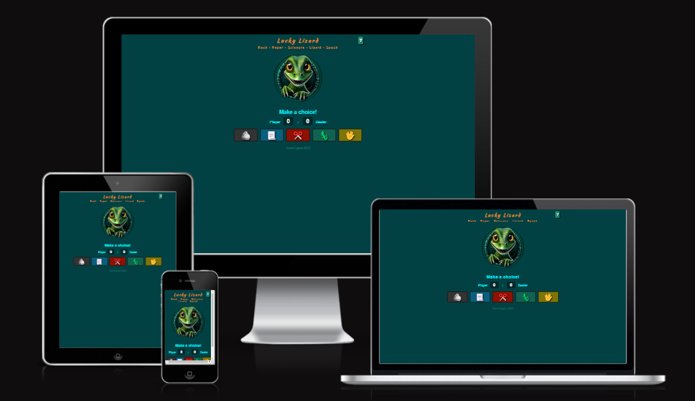
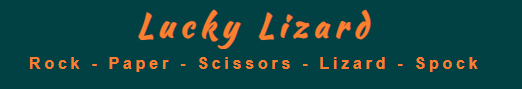
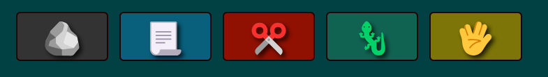
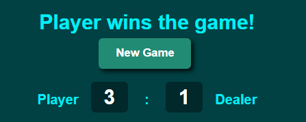
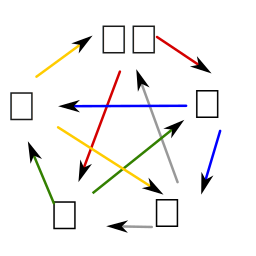

# Lucky Lizard

The Lucky Lizard game is a fun variation of the traditional Rock, Paper, Scissors game, with the addition of two more choices: Lizard and Spock (represented by emojis). Drawing inspiration from popular culture, this game variation promises an engaging and unpredictable experience, ensuring that each round is as thrilling as the last.

**Live Website**: [Lucky Lizard](https://cybercygnus.github.io/lucky-lizard/)

<p align="center">
  
</p>

**Responsive Design**:
The game interface is adaptive to various screen sizes, ensuring a consistent experience across devices. 'Mobile-First'approach.

## Features

### Existing Features

#### Header

The used font is **'Kaushan'**, which is a [Google Font](https://fonts.google.com/).

<p align="center">
  
</p>

#### Logo

<p align="center">
  
</p>

A captivating logo featuring a friendly, smiling cartoon lizard, which serves as the game's mascot and represents the dealer.

#### Interactive Gameplay

Engage in thrilling rounds of the expanded Rock, Paper, Scissors, Lizard, Spock game. Players make their choices by clicking on intuitive emoji symbols, with each round offering clear visual and textual feedback on the outcome.

<p align="center">
  
</p>

#### Dealer's Choice Highlight

The dealer's symbol choice is visually represented, with the same unique background color for each choice as for the player, offering an additional visual cue.

#### Dynamic Feedback

Real-time feedback is provided through the message field, indicating round winners and the overall game outcome.

<p align="center">
  
</p>

#### Detailed Game Outcomes

Each round displays a detailed message explaining the interaction between the player's and dealer's choices, enhancing understanding of game mechanics.

#### Scoreboard

The game displays a real-time scoreboard, reflecting the current scores of both the player and the dealer. This dynamic element updates immediately after each round, providing a visual representation of the game's status and allowing players to track their progress and performance.

<p align="center">
  
</p>

#### End of Game Logic & Reset

The game detects when a player or dealer reaches a score threshold, concluding the game. Players are then presented with options to start a new game.

<p align="center">
  
</p>

#### Modal Window with Game Rules

A modal window, accessible via a button, offers players a comprehensive overview of the game's rules, ensuring clarity. And image (svg) is added that depicts what entity wins over the other.

<p align="center">
  
</p>

### Features Left to Implement

- **Inactive Player Choice Buttons**: Make unchosen player buttons look inactive, similar to radio buttons.
- **Light Effects for Buttons**: Add a light effect to the winning symbol for a better visual experience.
- **Audio-Effects**: Add sound effects for moves, wins, and draws.
- **User Account Management**: Introduce a user registration and login system to allow players to create personal profiles, track their game history, and customize their gaming experience.
- **Customizable Game Length**: Allow players to determine the number of rounds for each game. This feature would be accessible via the modal window, providing flexibility in game duration based on player preference.
- **Betting Mechanism**: Let players bet on game outcomes for added excitement.
- **TRNG Implementation**: Use a True Random Number Generator for fair gameplay.
- **Verification**: Add a system based on cryptography and timestamps to show the game is fair and the computer isn't biased.

## Testing

The website has been tested for responsiveness with Google-Inspect.

### Device testing

- Laptop: The website was tested on an Asus Vivobook 17" laptop, providing a comprehensive view of the website's layout and responsiveness. Additionally, a connected 37" monitor was utilized to evaluate the website's performance on larger screens.
- Mobile Phone: Testing also included mobile devices such as the Blackview smartphone, ensuring that the website functions optimally in both vertical and horizontal views. This guarantees a user-friendly experience for visitors accessing the site on their smartphones.
- Tablet: The website was tested on a Samsung Galaxy tablet to ensure proper display and functionality on tablet devices, optimizing the browsing experience for users who prefer this form factor.

### Validator Testing

- **Accessability**:
  - I checked the site on Google Lighthouse for performance and optimization:

<p align="center">
  
</p>

- **HTML**:

  - Utilized the [W3C HTML Validator](https://validator.w3.org/) to verify the markup validity of the web documents.
  - Detected issues related to orphan closing div tags and trailing slashes on void elements.
  - Both issues were promptly addressed and resolved.
  - [View the validation results](https://validator.w3.org/nu/?doc=https%3A%2F%2Fcybercygnus.github.io%2Flucky-lizard%2F).

- **CSS**:
  - The CSS has been validated using the W3C CSS Validator and is compliant.

<div align="center">


</div>

- **JavaScript**
  - [Jshint validator](https://jshint.com/): During validation with JSHint, warnings related to ES6 syntax were observed. These are intentional, as the project targets modern browsers.

### Unfixed Bugs

**SVG Arrow-tip Rendering Issue**: While the arrow-tips in the SVG display as intended in Inkscape, they turn black when optimized for web use. I considered using a PNG as a workaround, but opted against it due to the minimal aesthetic impact. The issue is deemed negligible for the current project scope.

**Modal Positioning Issue**: The modal does not start at the top as intended, making it scrollable. Despite efforts to fix it, I couldn't find a solution, due to time constraints. Though its impact on overall functionality is minimal.

#### Google-Lighthouse

### Lighthouse Findings and Responses

- **Low Contrast**: The tool flagged a low contrast ratio for the text in the footer. This design choice was intentional. The subdued contrast in the ensures that players are not distracted from the main game interface, prioritizing user experience and focus on the gameplay.

- **Progressive Web App (PWA) Limitations**: While the website functions as intended and provides a smooth user experience, Lighthouse highlighted certain issues related to Progressive Web App (PWA) standards. Although I'm still in the process of understanding these recommendations, I believe they are not critical for the current scope of the project. However, they might be considered for future enhancements.

## Deployment

### Standard Deployment to GitHub

1. Initial setup of the repository on GitHub.
2. Cloning the repository to the local machine.
3. Regular commits and pushes to the GitHub repository during development.

### Transition to Branching and Feature Management

In the early stages of the development process, I used to manage different versions of my projects separately. However, as I delved deeper into the world of version control, I recognized the power and efficiency of branching in Git.

During the development of this project:

1. I began experimenting with branching to manage distinct features and ensure the main branch's stability.
2. I created a new branch for a particular feature that seemed to be growing in complexity. This allowed me to develop and experiment without risking the integrity of the main project.
3. While I'm still in the early stages of mastering branching and am cautious about merging, I'm committed to integrating this best practice into my workflow. The learning curve has its challenges, but I'm keen on ensuring that I don't mix up versions and maintain a clean version history.

### Tools and Software Used for Testing and Design

- **GIMP**: Utilized for editing and optimizing screenshots and other graphical assets for the project. This ensured that images were of the right size and quality, enhancing the website's performance and visual appeal.

- **Inkscape**: Used to design the project's wireframes and outline the game structure. This vector graphics software facilitated precise design planning, ensuring a clear and effective user interface and experience. During the early development phase, I utilized Inkscape to create wireframes that depicted the exact positioning of divs using layers. This process also involved selecting colors and experimenting with various design ideas.

<p align="center">
  
</p>

By using these tools, I was able to maintain a consistent design throughout the project and ensure that all visual elements were optimized for web performance.

- **Midjourney**: Utilized to create the "Lucky Lizard" logo. With a prompt of

```
cute lizard graphic logo, 3D vector illustration, t-shirt graphic, centered image, unique
```

Midjourney provided a distinctive and fitting logo for the game. **As a paying member of Midjourney, I have full ownership rights** to the assets I create with their services, in accordance with their Terms of Service.

## Code Explanations

### CSS Flex Property in `.choice`

In `style.css`, `flex: 0 1 calc(20% - 10px);` is used in the `.choice` class. This property is shorthand for setting three properties of a flex item: `flex-grow`, `flex-shrink`, and `flex-basis`.

- `flex-grow: 0;` - This allows the item to grow and take up any extra space in the container if it's available. The `0` value means all flex items will not grow beyond their initial size even if there is additional space in the container.

- `flex-shrink: 1;` - This means that the item can shrink if the container becomes too small. A value of `1` means all flex items will shrink at the same rate if necessary.

- `flex-basis: calc(20% - 10px);` - This sets the initial main size of the item before it's distributed space according to the flex factors (`flex-grow` and `flex-shrink`). `calc(20% - 10px)` is used to calculate the width of each item. It's set to 20% of the container's width minus 10px for the margin around items.
  Source: [Using CSS flexible boxes - CSS: Cascading Style Sheets | MDN](https://developer.mozilla.org/en-US/docs/Web/CSS/CSS_Flexible_Box_Layout/Using_CSS_flexible_boxes)

### JavaScript

The script uses a set of global variables to manage the game state:

- `gameRules`: An object that maps each choice to an array of choices it can defeat.
- `playerScore` and `dealerScore`: Counters for the player's and dealer's scores.

---

#### `dealerChoice()`

**Purpose:**  
Generates a random choice for the dealer among the available game symbols.

**Returns:**  
A string representing the dealer's choice.

**Implementation:**  
The function selects a random choice from the `choices` array using a combination of `Math.random()` and array indexing.

---

#### Determining the Winner

`determineWinner(player, dealer)`

**Purpose:**  
Compares the player's and dealer's choices to decide the round's outcome.

**Parameters:**

- `player`: A string representing the player's choice.
- `dealer`: A string representing the dealer's choice.

**Returns:**  
A string indicating the winner: 'player', 'dealer', or 'draw'.

**Implementation:**  
The function uses the `gameRules` object to compare the choices. If the player's choice is found in the dealer's defeat list, the player wins, and vice versa. If both choices match, it's a draw.

---

#### Main Game Logic

`playGame(playerChoice)`

**Purpose:**  
Executes the main game logic. This includes determining the winner, updating scores, and reflecting the results in the UI.

**Parameters:**

- `playerChoice`: A string representing the player's choice.

**Implementation:**  
After determining the round's winner using `determineWinner()`, the function updates the appropriate score counter (`playerScore` or `dealerScore`). It also updates the game's UI elements (`messageElement`, `playerScoreElement`, `dealerScoreElement`, and `dealerChoiceDisplay`) to reflect the results.

---

#### Game Flow

- **`gameInProgress` State Variable**:  
  A state variable, `gameInProgress`, has been added to track if a game round is currently ongoing. This prevents new rounds from starting while one is already in progress, ensuring game integrity. The `playGame` function now checks if a game round is in progress before initiating a new one. This ensures that players can't trigger multiple game rounds by clicking rapidly.

- **`setTimeout()` for Game Flow Control**:  
  The `setTimeout()` method is used to introduce a delay in the game flow, giving the player time to read the outcome before a new round starts.

#### Detailed Game Outcomes Message:

**Purpose:**  
To provide players with a comprehensive message detailing the outcome of each round based on the choices made by both the player and the dealer.

**Parameters:**

- `playerChoice`: A string representing the player's selected symbol.
- `dealerChoice`: A string representing the dealer's randomly selected symbol.

**Implementation:**  
The function retrieves the corresponding action verb (e.g., "crushes", "cuts") based on the player's and dealer's choices from a predefined list of interactions. The message is then formatted using the retrieved action verb and the names of the chosen symbols. The final message format is: `[Winner's Symbol][Winner's Symbol Name] [Action] [Defeated Symbol Name]`. This message is then displayed to the player to provide clarity on the round's outcome.

#### End of Game Logic & UI

**Purpose:**  
To detect when the game has reached its conclusion (either the player or the dealer achieves the winning score) and to present the user with appropriate end-of-game options.

**Parameters:**

- `winner`: A string indicating who won the game, either 'player' or 'dealer'.

**Implementation:**  
The function checks the scores of both the player and the dealer. If either score reaches the predetermined winning threshold (e.g., a score of 10), the game concludes. The UI is then updated to display the overall winner and present options to the player, such as starting a new game or exiting.

#### Introduced game reset functionality

**Purpose:**  
To reset the game state, allowing players to start a new game without refreshing the page or manually resetting game elements.

**Parameters:**  
None.

**Implementation:**  
The function resets all game-related variables to their initial states, such as setting scores to zero. It also updates the UI elements to reflect the reset state, clearing any messages and resetting visual indicators. This ensures that players can seamlessly start a new game round after the previous game concludes.

---

#### Modal Window Implementation

**Purpose:**  
To provide players with a comprehensive overview of the game's rules in an easily accessible and user-friendly manner.

**Parameters:**  
None.

**Implementation:**  
A modal window is implemented using a combination of HTML, CSS, and JavaScript. The modal is initially hidden and is displayed when the player clicks on a designated button or link. The modal contains detailed game rules and interactions, ensuring players have a clear understanding of the game mechanics. The modal can be closed by the player, either by clicking on a close button or by clicking outside the modal area.

---

#### Event Handlers

**Purpose:**  
Bind user interactions with the game symbols to trigger game rounds.

**Implementation:**  
For each choice symbol (button) with the class `.choice`, a click event listener is attached. Upon a click, the chosen symbol is passed to the `playGame()` function, initiating a game round.

## Credits

- **Grammar and Orthography**: For ensuring clarity and correctness in the documentation, I utilized tools like 'Google Translator' and other A.I. systems.

- **Image Creation and Inspiration**: Leveraged the capabilities of advanced A.I. systems to assist in image creation and derive inspiration for various design elements. However, the creativity, effort, time (90 hours), and core essence of the project are a my original work.

- **Tutorials and Learning Resources**:

  - Gained valuable insights from YouTube tutorials, especially the "Rock Paper Scissors" example by [@BroCodez](https://youtu.be/8dWL3wF_OMw?t=23711).
  - [The Odin Project](https://www.theodinproject.com/paths/full-stack-javascript) provided hundreds of examples and best practices for scripting games like this, which were instrumental in refining the game logic.
  - [The modal window](https://www.w3schools.com/howto/howto_css_modals.asp)
  - [CSS flex box](https://developer.mozilla.org/en-US/docs/Web/CSS/CSS_Flexible_Box_Layout/Using_CSS_flexible_boxes)
  - ['setTimeout() for Game Flow Control](https://developer.mozilla.org/en-US/docs/Web/API/WindowOrWorkerGlobalScope/setTimeout)
  - [EventListener](https://developer.mozilla.org/en-US/docs/Web/API/EventTarget/addEventListener)
  - Array for `outcomes` object is used for storing key-value pairs. [MDN Web Docs - Object](https://developer.mozilla.org/en-US/docs/Web/JavaScript/Reference/Global_Objects/Object)

### Media

- **Symbols:** [Emojipedia](https://emojipedia.org/lizard/)
- **'Lucky-Lizard'-Logo:** Midjourney [cybercygnus](https://www.midjourney.com/app/jobs/343f6324-f9bb-4cc4-9f90-0733cf52b706/)
  - Isolated, added alpha-channel, and scaled with [Gimp](https://www.gimp.org/)

### Acknowledgements

I would like to thank my mentor, [Harry Dhillon](https://github.com/Harry-Leepz), for the guidance and encouragement given throughout the project. Following his valuable feedback and advice, the website has been refined to be more intuitive and it has improved the overall user experience.

---

Franenthal, Germany.
Duration: 2023-07-17 to 2023-08-17
Total Hours: 95
